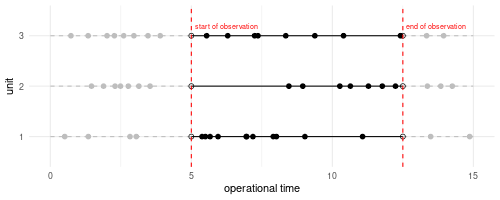

# Heavily censored lifetime data: simulation study

This repository is a simulation experiment to evaluate the method proposed in [*Leadbetter et al. 2021*](https://ieeexplore.ieee.org/document/9715184) for constraining bias in parameter estimates of the Weibull distribution when data are heavily censored. The repository for the paper can be found [here](https://github.com/rleadbett/Informative-Bayesian-Survival-Analysis-to-Handle-Heavy-Censoring-in-Lifetime-Data).

The motivation for the paper and this simulation experiment is to explore the ability of an informative Bayesian joint prior for the Weibull distribution parameters for constraining bias caused by heavy censoring. The motivating problem-which I base simulations around-is the repeated replacement of components on a mine site where good quality replacement data is only available for a limited time window. An example of this is Idlers on a conveyor belt, which get repeatedly replaced. However, historic failure data is only reliable in recent years since the location of the idler being replaced was not recorded before the company started to use a digital maintenance management program for the idlers. The combination of this limited history along with the fact that many idlers are still in operation at current and have not failed result is a unique but common censoring mechanism that causes heavy censoring in the lifetime data.

In this simulation study, I'll explore the effect of encoding information into a joint prior for the shape and scale parameters of the two-parameter Weibull has on reducing bias in the Weibull lifetime distribution parameter estimates. For comparison, I fit three models all with the same data model but with different prior distributions; the first has a non-informative prior (which is equivalent to fitting the model via maximum likelihood, which is the current norm in reliability); the second, has an informative prior that is specified as the product of independent marginal priors for each of the parameters; and the third has an informative joint prior specified using the method of Kaminskey.

## Model

### Data model

The data model that I fit here is the two parameter weibull distribution,

$$
y_i | \beta, \eta  \sim \hbox{Weibull}( \beta, \eta)
$$

where $\beta$ is the shape and $\eta$ the scale parameter. The Weibull distributions has probability density function

$$
f(y) = \frac{\beta}{\eta} \left(\frac{y}{\eta}\right)^{\beta - 1} \hbox{exp} \left( - \left(\frac{y}{\eta}\right)^\beta\right),
$$

and cumulative distribution function

$$
F(y) = 1 - \hbox{exp} \left( - \left(\frac{y}{\eta}\right)^\beta\right).
$$

To incorporate the censored observations we wright the likelihood as

$$
L(y) = \prod^I_{i = 1} \left[f(y_i)\right]^{o_i}\left[1  - F(y_i)\right]^{R_i}\left[F(y_i + t_{start})  - F(y_i)\right]^{I_i},
$$

where $O_i$, $R_i$, and $I_i$ are indicator variables identifying if observation $y_i$ is fully observed, right censored, or interval censored respectively. $t_{start}$ is the start of the observation period, which we define below in the Simulation method section.

### Noninformative prior

I prefer to use the term objective rather than noninformative. For the objective prior I specify independent marginal Gamma priors for both parameters of the with shape and rate close to zero. This prior is often used as an attempt at "noninformativeness" because it is easily dominated by the likelihood and so returns results very similar to a maximum likelihood approach. Whether or not this prior is a good choice is debated by Gelman, because when the data are poorly informative, it can place a lot of weight around zero. However, in this case it returns point estimates that are almost identical to MLE and so we use it for convenience.

$$
\beta, \eta \sim \hbox{Gamma}\left(0.0001, 0.0001\right)
$$

### Informative marginal priors

To specify an informative marginal prior we simply use normally distributed priors where the mean and standard deviation are selected to reflect the marginal distributions of the two parameter from the joint prior.

$$
\beta \sim \hbox{Normal}\left(\mu_\beta, \sigma_\beta\right) \\
\eta \sim \hbox{Normal}\left(\mu_\eta, \sigma_\eta\right)
$$

### Informative joint prior

To specify an informative joint prior we use the method of Kaminskiy. To specify the prior we start by eliciting information on the weibull CDF. This is done by estimating the value of the CDF at two exposure times and specifying some uncertainty in the estimate in the form of the means, $E(\hat{F}(t_1))$ and $E(\hat{F}(t_2))$, and standard deviations, $sd(\hat{F}(t_1))$ and $sd(\hat{F}(t_2))$, of two Beta distributions. We then calculate the parameters of the two beta distributions

$$
a_{t_i} = \frac{E\left(\hat{F}(t_i)\right)^2\left[1 - E\left(\hat{F}(t_i)\right)\right]}{sd\left(\hat{F}(t_i)\right)} \\
$$

$$
b_{t_i} = \frac{a_{t_i}}{E\left(\hat{F}(t_i)\right)} - a_{t_i}.
$$

We then draw duplets from the two beta distributions

$$
\hat{F}(t_1) \sim \hbox{Beta}\left(a_{t_1}, b_{t_1}\right) \\
\hat{F}(t_2) \sim \hbox{Beta}\left(a_{t_2}, b_{t_2}\right),
$$

ensuring that $\hat{F}(t_2) > \hat{F}(t_1)$, since the CDF must always be monotonic increasing. Using the joint draws along the CDF, we calculate the corresponding values of the Weibull parameters by

$$
\beta = \frac{g\left(\hat{F}(t_2)\right) - g\left(\hat{F}(t_1)\right)}{\log(t_2) - \log(t_1)}
$$

$$
\eta = \exp\left(\log(t_1) - \frac{g\left(\hat{F}(t_1)\right)}{\beta}\right),
$$

where $g(x) = \log(-\log(1 - x))$. This produces a joint draw of the Weibull parameters $(\beta, \eta)$ that encode our prior belief through both their values and covariance.

## Simulations

In order to simulate data that replicates the repeated replacement of a component, I sample $N \times M$ draws from a Weibull distribution with known shape parameter $\beta$, and scale parameter $\eta = 1$. I then assign these lifetimes to $M$ units. To calculate failure times rather than lifetimes, I take the cumulative sum of the $N$ lifetimes assigned to each unit. Installation times are calculated by taking the lag of the failure times. To emulate the censoring mechanism, I then define a start, $t_{start}$, and end, $t_{end}$, time for the observation window. Any lifetimes where both the install and failure times sit either before $t_{start}$ or after $t_{end}$ are discarded. Of the remaining lifetimes, if the install time is less than $t_{start}$ then $t_{start}$ is substituted for the install time and the lifetime is marked as interval censored, while if the failure time is greater than $t_{end}$ then $t_{end}$ is substituted as the failure time and the lifetime is marked as right censored. If a lifetime is both interval censored at the beginning of the lifetime and right censored at the end, then the install time is set as $t_{start}$, the failure time as $t_{end}$ and it is marked as right censored. *Figure 1* bellow shows an example data set where $\beta = 1.1$, $M = 3$, $t_{start} = 5$, and $t_{end} = 12.5$. The data for the observed lifetimes is shown in *Table 1*.

<table>
  <thead>
    <tr>
      <th width="500px"> Figure 1</th>
      <th width="500px"> Table 1</th>
    </tr>
  </thead>
  <tbody>
  <tr width="600px">
      <td>
 

</td>
<td>

<table class="table table-striped" style="margin-left: auto; margin-right: auto;">
 <thead>
  <tr>
   <th style="text-align:left;position: sticky; top:0;"> unit </th>
   <th style="text-align:right;position: sticky; top:0;"> true_lifetime </th>
   <th style="text-align:right;position: sticky; top:0;"> install_time </th>
   <th style="text-align:right;position: sticky; top:0;"> failure_time </th>
   <th style="text-align:left;position: sticky; top:0;"> int_censored </th>
   <th style="text-align:left;position: sticky; top:0;"> right_censored </th>
   <th style="text-align:right;position: sticky; top:0;"> observed_lifetime </th>
  </tr>
 </thead>
<tbody>
  <tr>
   <td style="text-align:left;"> 1 </td>
   <td style="text-align:right;"> 2.3335792 </td>
   <td style="text-align:right;"> 5.000000 </td>
   <td style="text-align:right;"> 5.380328 </td>
   <td style="text-align:left;"> TRUE </td>
   <td style="text-align:left;"> FALSE </td>
   <td style="text-align:right;"> 0.3803280 </td>
  </tr>
  <tr>
   <td style="text-align:left;"> 1 </td>
   <td style="text-align:right;"> 0.1189976 </td>
   <td style="text-align:right;"> 5.380328 </td>
   <td style="text-align:right;"> 5.499326 </td>
   <td style="text-align:left;"> FALSE </td>
   <td style="text-align:left;"> FALSE </td>
   <td style="text-align:right;"> 0.1189976 </td>
  </tr>
  <tr>
   <td style="text-align:left;"> 1 </td>
   <td style="text-align:right;"> 0.1671778 </td>
   <td style="text-align:right;"> 5.499326 </td>
   <td style="text-align:right;"> 5.666503 </td>
   <td style="text-align:left;"> FALSE </td>
   <td style="text-align:left;"> FALSE </td>
   <td style="text-align:right;"> 0.1671778 </td>
  </tr>
  <tr>
   <td style="text-align:left;"> 1 </td>
   <td style="text-align:right;"> 0.2815103 </td>
   <td style="text-align:right;"> 5.666503 </td>
   <td style="text-align:right;"> 5.948014 </td>
   <td style="text-align:left;"> FALSE </td>
   <td style="text-align:left;"> FALSE </td>
   <td style="text-align:right;"> 0.2815103 </td>
  </tr>
  <tr>
   <td style="text-align:left;"> 1 </td>
   <td style="text-align:right;"> 0.9986986 </td>
   <td style="text-align:right;"> 5.948014 </td>
   <td style="text-align:right;"> 6.946712 </td>
   <td style="text-align:left;"> FALSE </td>
   <td style="text-align:left;"> FALSE </td>
   <td style="text-align:right;"> 0.9986986 </td>
  </tr>
  <tr>
   <td style="text-align:left;"> 1 </td>
   <td style="text-align:right;"> 0.0149579 </td>
   <td style="text-align:right;"> 6.946712 </td>
   <td style="text-align:right;"> 6.961670 </td>
   <td style="text-align:left;"> FALSE </td>
   <td style="text-align:left;"> FALSE </td>
   <td style="text-align:right;"> 0.0149579 </td>
  </tr>
  <tr>
   <td style="text-align:left;"> 1 </td>
   <td style="text-align:right;"> 0.2215068 </td>
   <td style="text-align:right;"> 6.961670 </td>
   <td style="text-align:right;"> 7.183177 </td>
   <td style="text-align:left;"> FALSE </td>
   <td style="text-align:left;"> FALSE </td>
   <td style="text-align:right;"> 0.2215068 </td>
  </tr>
  <tr>
   <td style="text-align:left;"> 1 </td>
   <td style="text-align:right;"> 0.7213708 </td>
   <td style="text-align:right;"> 7.183177 </td>
   <td style="text-align:right;"> 7.904548 </td>
   <td style="text-align:left;"> FALSE </td>
   <td style="text-align:left;"> FALSE </td>
   <td style="text-align:right;"> 0.7213708 </td>
  </tr>
  <tr>
   <td style="text-align:left;"> 1 </td>
   <td style="text-align:right;"> 0.1123698 </td>
   <td style="text-align:right;"> 7.904548 </td>
   <td style="text-align:right;"> 8.016918 </td>
   <td style="text-align:left;"> FALSE </td>
   <td style="text-align:left;"> FALSE </td>
   <td style="text-align:right;"> 0.1123698 </td>
  </tr>
  <tr>
   <td style="text-align:left;"> 1 </td>
   <td style="text-align:right;"> 1.0094550 </td>
   <td style="text-align:right;"> 8.016918 </td>
   <td style="text-align:right;"> 9.026373 </td>
   <td style="text-align:left;"> FALSE </td>
   <td style="text-align:left;"> FALSE </td>
   <td style="text-align:right;"> 1.0094550 </td>
  </tr>
  <tr>
   <td style="text-align:left;"> 1 </td>
   <td style="text-align:right;"> 2.0458791 </td>
   <td style="text-align:right;"> 9.026373 </td>
   <td style="text-align:right;"> 11.072252 </td>
   <td style="text-align:left;"> FALSE </td>
   <td style="text-align:left;"> FALSE </td>
   <td style="text-align:right;"> 2.0458791 </td>
  </tr>
  <tr>
   <td style="text-align:left;"> 1 </td>
   <td style="text-align:right;"> 2.4151111 </td>
   <td style="text-align:right;"> 11.072252 </td>
   <td style="text-align:right;"> 12.500000 </td>
   <td style="text-align:left;"> FALSE </td>
   <td style="text-align:left;"> TRUE </td>
   <td style="text-align:right;"> 1.4277483 </td>
  </tr>
  <tr>
   <td style="text-align:left;"> 2 </td>
   <td style="text-align:right;"> 4.9208232 </td>
   <td style="text-align:right;"> 5.000000 </td>
   <td style="text-align:right;"> 8.459079 </td>
   <td style="text-align:left;"> TRUE </td>
   <td style="text-align:left;"> FALSE </td>
   <td style="text-align:right;"> 3.4590789 </td>
  </tr>
  <tr>
   <td style="text-align:left;"> 2 </td>
   <td style="text-align:right;"> 0.4917245 </td>
   <td style="text-align:right;"> 8.459079 </td>
   <td style="text-align:right;"> 8.950803 </td>
   <td style="text-align:left;"> FALSE </td>
   <td style="text-align:left;"> FALSE </td>
   <td style="text-align:right;"> 0.4917245 </td>
  </tr>
  <tr>
   <td style="text-align:left;"> 2 </td>
   <td style="text-align:right;"> 1.3149030 </td>
   <td style="text-align:right;"> 8.950803 </td>
   <td style="text-align:right;"> 10.265707 </td>
   <td style="text-align:left;"> FALSE </td>
   <td style="text-align:left;"> FALSE </td>
   <td style="text-align:right;"> 1.3149030 </td>
  </tr>
  <tr>
   <td style="text-align:left;"> 2 </td>
   <td style="text-align:right;"> 0.3738659 </td>
   <td style="text-align:right;"> 10.265707 </td>
   <td style="text-align:right;"> 10.639572 </td>
   <td style="text-align:left;"> FALSE </td>
   <td style="text-align:left;"> FALSE </td>
   <td style="text-align:right;"> 0.3738659 </td>
  </tr>
  <tr>
   <td style="text-align:left;"> 2 </td>
   <td style="text-align:right;"> 0.6401679 </td>
   <td style="text-align:right;"> 10.639572 </td>
   <td style="text-align:right;"> 11.279740 </td>
   <td style="text-align:left;"> FALSE </td>
   <td style="text-align:left;"> FALSE </td>
   <td style="text-align:right;"> 0.6401679 </td>
  </tr>
  <tr>
   <td style="text-align:left;"> 2 </td>
   <td style="text-align:right;"> 0.4924500 </td>
   <td style="text-align:right;"> 11.279740 </td>
   <td style="text-align:right;"> 11.772190 </td>
   <td style="text-align:left;"> FALSE </td>
   <td style="text-align:left;"> FALSE </td>
   <td style="text-align:right;"> 0.4924500 </td>
  </tr>
  <tr>
   <td style="text-align:left;"> 2 </td>
   <td style="text-align:right;"> 0.4656813 </td>
   <td style="text-align:right;"> 11.772190 </td>
   <td style="text-align:right;"> 12.237872 </td>
   <td style="text-align:left;"> FALSE </td>
   <td style="text-align:left;"> FALSE </td>
   <td style="text-align:right;"> 0.4656813 </td>
  </tr>
  <tr>
   <td style="text-align:left;"> 2 </td>
   <td style="text-align:right;"> 1.1320400 </td>
   <td style="text-align:right;"> 12.237872 </td>
   <td style="text-align:right;"> 12.500000 </td>
   <td style="text-align:left;"> FALSE </td>
   <td style="text-align:left;"> TRUE </td>
   <td style="text-align:right;"> 0.2621284 </td>
  </tr>
  <tr>
   <td style="text-align:left;"> 3 </td>
   <td style="text-align:right;"> 1.6449929 </td>
   <td style="text-align:right;"> 5.000000 </td>
   <td style="text-align:right;"> 5.543429 </td>
   <td style="text-align:left;"> TRUE </td>
   <td style="text-align:left;"> FALSE </td>
   <td style="text-align:right;"> 0.5434286 </td>
  </tr>
  <tr>
   <td style="text-align:left;"> 3 </td>
   <td style="text-align:right;"> 0.7466901 </td>
   <td style="text-align:right;"> 5.543429 </td>
   <td style="text-align:right;"> 6.290119 </td>
   <td style="text-align:left;"> FALSE </td>
   <td style="text-align:left;"> FALSE </td>
   <td style="text-align:right;"> 0.7466901 </td>
  </tr>
  <tr>
   <td style="text-align:left;"> 3 </td>
   <td style="text-align:right;"> 0.9536184 </td>
   <td style="text-align:right;"> 6.290119 </td>
   <td style="text-align:right;"> 7.243737 </td>
   <td style="text-align:left;"> FALSE </td>
   <td style="text-align:left;"> FALSE </td>
   <td style="text-align:right;"> 0.9536184 </td>
  </tr>
  <tr>
   <td style="text-align:left;"> 3 </td>
   <td style="text-align:right;"> 0.1193156 </td>
   <td style="text-align:right;"> 7.243737 </td>
   <td style="text-align:right;"> 7.363053 </td>
   <td style="text-align:left;"> FALSE </td>
   <td style="text-align:left;"> FALSE </td>
   <td style="text-align:right;"> 0.1193156 </td>
  </tr>
  <tr>
   <td style="text-align:left;"> 3 </td>
   <td style="text-align:right;"> 0.9840197 </td>
   <td style="text-align:right;"> 7.363053 </td>
   <td style="text-align:right;"> 8.347072 </td>
   <td style="text-align:left;"> FALSE </td>
   <td style="text-align:left;"> FALSE </td>
   <td style="text-align:right;"> 0.9840197 </td>
  </tr>
  <tr>
   <td style="text-align:left;"> 3 </td>
   <td style="text-align:right;"> 1.0321284 </td>
   <td style="text-align:right;"> 8.347072 </td>
   <td style="text-align:right;"> 9.379201 </td>
   <td style="text-align:left;"> FALSE </td>
   <td style="text-align:left;"> FALSE </td>
   <td style="text-align:right;"> 1.0321284 </td>
  </tr>
  <tr>
   <td style="text-align:left;"> 3 </td>
   <td style="text-align:right;"> 1.0173716 </td>
   <td style="text-align:right;"> 9.379201 </td>
   <td style="text-align:right;"> 10.396572 </td>
   <td style="text-align:left;"> FALSE </td>
   <td style="text-align:left;"> FALSE </td>
   <td style="text-align:right;"> 1.0173716 </td>
  </tr>
  <tr>
   <td style="text-align:left;"> 3 </td>
   <td style="text-align:right;"> 2.0184380 </td>
   <td style="text-align:right;"> 10.396572 </td>
   <td style="text-align:right;"> 12.415010 </td>
   <td style="text-align:left;"> FALSE </td>
   <td style="text-align:left;"> FALSE </td>
   <td style="text-align:right;"> 2.0184380 </td>
  </tr>
  <tr>
   <td style="text-align:left;"> 3 </td>
   <td style="text-align:right;"> 0.9272254 </td>
   <td style="text-align:right;"> 12.415010 </td>
   <td style="text-align:right;"> 12.500000 </td>
   <td style="text-align:left;"> FALSE </td>
   <td style="text-align:left;"> TRUE </td>
   <td style="text-align:right;"> 0.0849897 </td>
  </tr>
</tbody>
</table>

</td>
</tr>

  </tbody>
</table>

### Simulation factors

Due to the randomness in the data simulation and observation process, there are only a handful of parameters that we actually have control over. The rest are stochastic and so we will have to record their values and explore their relationship with the bias in parameter estimates under the few factors that we can control. The factors in the simulations that we can control are shown in the table below.

| Factor | Description | Values |
| --- | --- | --- |
| $\beta$ | The value of the Weibull shape parameter. |  |
| $(t_1, t_2)$ | The times at which information is elicited on the CDF. |  |
| $F(t_i) - E\left(\hat{F}(t_i)\right)$ | The accuracy of the estimates of the CDF. |  |
| $sd\left(\hat{F}(t_i)\right)$ | The uncertainty in the estimates of the CDF. |  |
| $t_{start}$ | The start of observations time. |  |
| $t_{end} - t_{start}$ | The length of the observation period. |  |

To simplify the number of factors that relate to the informative prior I simplify the specification of the prior using uncertainty in the cdf comparable to repeatedly observing a lifetime dataset of x units. For example, I'll simulate 10000 lifetime datasets of x observations and calculate the mean and standard deviation of the inferred CDFs (using MLE) at time $t_1$ and $t_2$. Ill then specify some misspecification through the parameter $\phi$. Phi is a quantile of the beta distributions in the Kaminskiy joint prior, and so can have any value between zero and 1. The misspecification of $E(\hat{F}(t_i))$ is calculated as

$$
E_{misspecified}\left(\hat{F}(t_i)\right) = E\left(\hat{F}(t_i)\right) + \left( F_{Beta}^{-1}(\phi| a_{t_i}, b_{t_i}) - F_{Beta}^{-1}(0.5| a_{t_i}, b_{t_i}) \right)
$$

where $F_{Beta}^{-1}(.)$ is the inverse CDF of the Beta distribution. This method may seem overly complicated, but in ensures that the estimate of the CDF is always between zero and one and takes into account the uncertainty in the estimate.

### Recorded parameters

The factors that will be measured in the simulations.

| Factor | Description |
| --- | --- |
| $N$ | The sample size. |
| $N_o$ | The number of observed failures. |
| $N_R / N$ | The proportion of right censoring. |
| $N_I / N$ | The proportion of interval censoring. |
| $Max\left([y_i]^{O_i}\right)$ | The maximum fully observed lifetime. |
| $\beta - \hat{\beta}$ | The bias in the parameter estimate of the shape. |
| $\eta - \hat{\eta}$ | The bias in the parameter estimate of the scale. |

### Analysis

## Bibliography

R. Leadbetter, A. Phatak, A. Polpo and M. Hodkiewicz, "Informative Bayesian Survival Analysis to Handle Heavy Censoring in Lifetime Data," 2021 International Conference on Maintenance and Intelligent Asset Management (ICMIAM), Ballarat, Australia, 2021, pp. 1-6, doi: 10.1109/ICMIAM54662.2021.9715184

Kaminskiy, Mark P., and Vasiliy V. Krivtsov. ‘A Simple Procedure for Bayesian Estimation of the Weibull Distribution’. IEEE Transactions on Reliability 54, no. 4 (2005): 612–16. https://doi.org/10.1109/TR.2005.858093.
